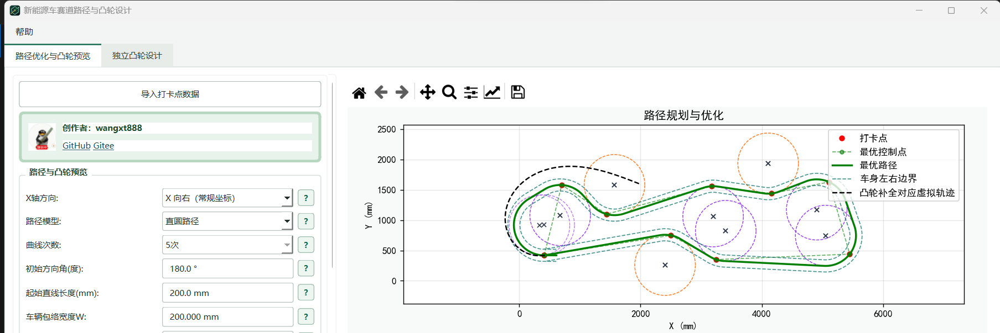
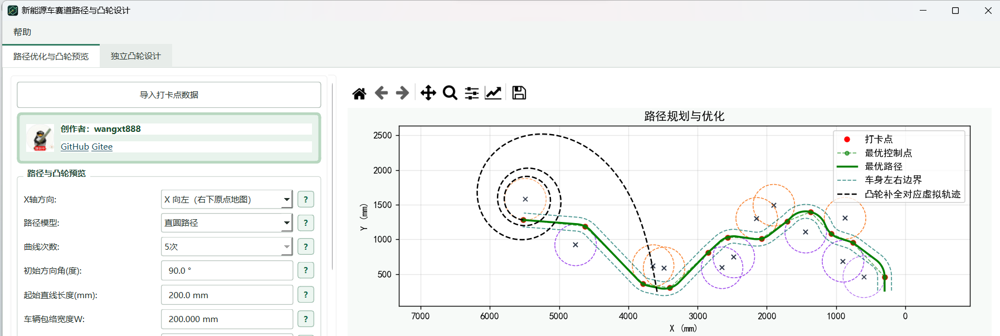

<div align="center">


# 新能源车赛道路径与凸轮设计

面向中国大学生工程实践与创新能力大赛新能源车赛道的路径规划、任务区校核与凸轮轮廓计算工具。

[](https://www.python.org/)
[](https://doc.qt.io/qtforpython-6/)
[](../../releases)
[](LICENSE)

[下载运行包](../../releases) · [快速开始](#快速开始) · [路径模式与效果](#路径模式与效果) · [使用说明](#使用流程)

</div>


路径、带符号曲率和凸轮轮廓在同一个界面中联动。导入打卡点后，可以添加禁止区、短边通道和指定入口情景区，运行路径优化。路径页的凸轮仅用于快速参考，正式凸轮加工请按比赛和机构要求到指定工具复核。
> [!IMPORTANT]
> 图片为旧版本主要功能一致，以最新为准。
> 本人正在与01铁匠（qq群：862127093）合作中！！！故软件完美适配其网站，该app目前定位为产生路径点或者直线或圆组合，导出请到01铁匠店铺，目前软件一起售卖中，加量不加价，快来体验！！！！！

> [!IMPORTANT]
> 软件会同时输出从动件中心的理论轮廓和考虑从动件半径的实际二维包络。更多细节请看[详细讲解视频以及下面介绍](assets/screenshots/app-overview.png) 待上传......

## 核心能力

| | 功能 | 说明 |
|---|---|---|
| 路径规划 | 固定起终点与起始方向 | 支持平滑曲线和直圆路径两种模式 |
| 场景任务 | 禁止区、短边通道、指定入口情景区 | 矩形可旋转，可在图中框选，也可输入中心、尺寸和角度 |
| 整车校核 | 车辆宽度与附加安全距离 | 约束检查考虑车辆包络，不只检查路径中心线 |
| 凸轮预览 | 路径优化时同步计算 | 支持顶摆球、顶摆杆、长圆槽/平推和扇面齿轮模型 |
| 坐标适配 | X 向右或 X 向左 | 适配常规地图和右下角原点地图，并统一左右转曲率符号 |
| 结果导出 | Excel 路径与直圆参数 | 路径导出为 Excel，直圆使用起终点与精简圆参数 |

## 快速开始

### Windows 免安装包

在 [Releases](../../releases) 下载 `CamDesigner-Windows-x64_xxx.zip`，完整解压后运行 `CamDesigner.exe`。运行库和图片资源位于同一文件夹中，不要只复制 EXE。

当前运行版为专有软件，需按授权提示激活，分为免费版和付费版，免费版可以使用初导出外的功能，付费版均可使用。保存路径数据时会显示一次性挑战码，
将挑战码发给授权方并输入返回的答案后即可导出，（免费版可以导出1次试用请联系管理员 01铁匠qq：614512962 或者本人qq:3942477659  ）。挑战码每次都会变化，旧答案不能复用。

### 历史公开版

仓库中可能保留较早的公开源码，便于学习基础计算思路。历史版不包含当前运行版的完整功能，
也不作为当前商业版的构建源码。需要稳定使用时，请下载 Release 中的 Windows 运行包。

## 使用流程


演示采用 **5 次曲线和 600 次迭代**，最后一帧同时展示路径、曲率、凸轮轮廓与结果导出入口。

1. 导入 `examples/` 或自己的打卡点文件。（打卡点第三列为权重，越大对该点的限制越大）
2. 选择 X 轴方向和路径模型，设置曲线次数或相切圆半径范围、初始方向角和起始直线长度。
3. 根据赛题添加禁止区、短边通道或指定入口情景区。
4. 选择车型，填写机构尺寸和从动件半径；参数旁的 `?` 可以查看测量位置和正负号。
5. 设置允许偏差、粒子数和迭代数，开始路径规划。
6. 检查路径、任务区、曲率和凸轮工作角，再保存结果。

规划过程中可以暂停，使用路径图工具栏缩放和平移；继续规划时会恢复完整视野。相同数据、参数和随机种子可以复现同一次优化结果。

## 路径模式与效果

### 平滑曲线路径

平滑曲线路径会在允许偏差和场景约束内持续优化控制点，兼顾路径长度、曲率变化和凸轮轮廓。它适合需要同时观察车辆轨迹、曲率与凸轮平滑性的常规赛题。

两组动画均由程序真实训练生成，统一采用600 次迭代、30 mm 允许偏差、200 mm 起始直线和随机种子 2026。

#### 太阳能电动车现场初赛

`examples/2027_solar_preliminary.txt` · X 向右 · 初始方向 `75.9638°` · 传动比 `42` · 最大偏差 `25.16 mm`


#### 生物质能电动车现场初赛

`examples/2027_biomass_preliminary.txt` · X 向左 · 初始方向 `46.8087°` · 传动比 `20` · 最大偏差 `29.69 mm`


> [!NOTE]
> 初始方向按数据坐标计算：`0°` 沿 `+X`，`90°` 沿 `+Y`。生物质能地图的原点位于右下角，因此选择“X 向左（右下原点地图）”。

### 直圆路径

直圆路径由相切圆弧和直线组成。程序按给定初始方向依次通过打卡点，在车辆前进方向内搜索各点朝向，并在界面设置的相切圆半径范围内寻找可行解。

它不需要粒子群迭代，通常计算更快，圆心和带符号半径也便于继续加工或校核。若提示无解，可先减小最小相切圆半径，再检查起始方向、起始直线、障碍物和场地边界是否过紧。

| 太阳能电动车直圆路径 | 生物质能电动车直圆路径 |
|---|---|
|  |  |

> [!IMPORTANT]
> 直圆结果需要搭配 [01铁匠网站](http://43.143.111.245:3030/) 的对应导入优化功能继续使用。该服务需要付费，但提供售后支持，当前配套流程较稳定，速度飞快；需要的可以加qq群：862127093了解。

## 路径任务


| 任务 | 路径要求 |
|---|---|
| 禁止矩形 | 车辆包络不得进入矩形及其安全边界 |
| 短边通道 | 从一条短边进入、另一条短边离开，不得穿过长边 |
| 指定入口情景区 | 必须从指定短边首次进入，离开方向不限，但不得从其他边再次进入 |
| 活动边界 | 确保小车不出设定的场地边界 |
方向角 `θ` 是矩形中心指向长轴前端与 `+X` 的夹角。单击任务列表可以选中任务，双击或点击“编辑选中”可以修改尺寸、角度、类型和入口方向。

<details>
<summary><strong>打卡点格式与权重</strong></summary>

每行填写 `X Y`，单位为 mm；可选第三列为权重 `w`：

```text
5588 713
4463 375 2
2925 825 0.5
```

没有第三列时权重默认为 `1`。该点实际允许偏差为“界面允许偏差 ÷ 权重”：权重越大，路径越不能偏离该点。首点和末点固定，权重主要影响中间打卡点。

</details>

<details>
<summary><strong>车型、曲率与参数正负号</strong></summary>

俯视车辆并让车头朝前时，凸轮位于前轮右侧则机构尺寸 `E` 为正，位于左侧则为负。

`M` 是有符号后轮轮距，绝对值为左右后轮中心距：左后轮带动凸轮时填正值，右后轮带动时填负值；使用后轴中心转速或左右轮平均转速时填 `0`。程序用主动后轮累计滚动路程计算凸轮角度。`M` 与只用于碰撞检查的车辆包络宽度 `W` 不同。

程序内的“车型、公式与正负号”窗口包含四种机构的公式、尺寸测量位置和示意图。正式加工前，请用自己的三维装配尺寸重新校核。


**车型图片来源：[01铁匠](http://43.143.111.245:3030/)**。
图片来源与本人为合作关系，暂不涉及版权问题
</details>

<details>
<summary><strong>导出文件</strong></summary>

路径页生成：

```text
result.xlsx             # 真实工作路径：轨迹X坐标、轨迹Y坐标
result_full_path.xlsx   # 真实路径 + 凸轮补全对应的虚拟路径
circles.xlsx            # 起点、精简圆参数、终点；最后一个圆省略
cam_xyz_theoretical.txt # 独立凸轮页导出的从动件中心理论凸轮 X、Y、Z 坐标
```

路径 Excel 包含真实路径与包含虚拟段的完整路径两个文件，每个文件只有“轨迹X坐标、轨迹Y坐标”两列。精简直圆 Excel 保留 `R=0` 的起点和终点，包含中间圆心与带符号半径。独立凸轮页仅导出从动件中心理论凸轮 XYZ，实际加工包络不在该页导出。（导出请到01铁匠网站）

</details>

## 版本与商用

当前商业运行版采用[专有软件许可](LICENSE)，不随运行包提供当前版本源码，也不允许未经书面授权的复制、修改、再发布、转售或商业服务。
仓库中若保留较早的公开版本，该历史版本仍按它发布时的许可证使用，不代表获得当前商业版源码或功能的权利。

界面使用 PySide6。Qt、PySide6 和其他依赖仍按各自许可证授权，运行包保留
`THIRD_PARTY_NOTICES.txt`、`licenses/LGPL-3.0.txt`、Qt/PySide6 的 LGPL 使用说明
以及实际运行依赖的许可证汇总。项目自身代码和配套资源按当前商业版许可发布，
不因使用开源运行组件而公开项目源代码。

商业授权、定制功能、内部部署和再发布请联系 `luyu12w@gmail.com`或者本人qq:3942477659或者  合作者：铁匠qq：614512962。

## 贡献者

<div align="center">

<a href="https://github.com/wangxt888/cam-designer/graphs/contributors">
  
</a>

感谢每一位参与代码、测试、文档和实车验证的贡献者。

</div>

---

<div align="center">

由 [wangxt888](https://github.com/wangxt888) 维护。对路径规划、凸轮设计或软件功能有任何想法，欢迎邮件交流：[luyu12w@gmail.com](mailto:luyu12w@gmail.com)。

如果项目对你的备赛有帮助，欢迎点一个 **Star**。商业授权、功能定制和合作方案可通过邮件沟通。

### 微信支持

如果软件节省了你的备赛时间，也欢迎自愿支持后续维护。


</div>
