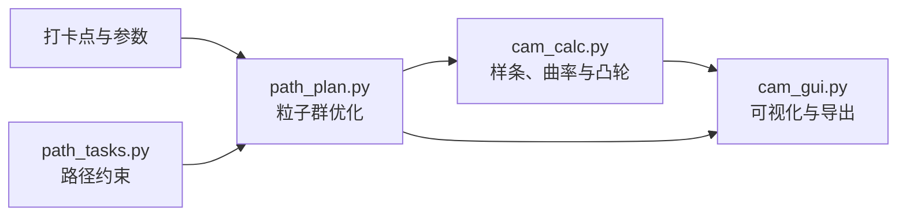

<div align="center">

<!-- 获得赛事标识使用许可后，将官方 Logo 保存为 assets/competition-logo.png 并取消下一行注释。 -->
<!--  -->

# 新能源车赛道凸轮建模与路径优化工具

**中国大学生工程实践与创新能力大赛 · 新能源车赛道**

从赛道打卡点出发，完成二维路径优化、带符号曲率计算、机械转向凸轮建模、闭环补全与离散坐标导出。

[](#环境要求)
[](#开源许可证与-pyqt5-说明)
[](#开源许可证与-pyqt5-说明)
[](#已知限制)

</div>

> [!NOTE]
> 本项目主要面向新能源车赛道中“给定打卡点与行驶约束，建立车辆路径，并将路径转向规律转换为机械凸轮轮廓”的建模任务。项目由参赛者独立开发，不代表赛事主办方，也不构成赛事官方软件或官方背书。

赛事信息以[中国大学生工程实践与创新能力大赛官网](http://www.gcxl.edu.cn/new/index.html)及当届新能源车赛道正式命题、运行和评分文件为准。

| 路径建模 | 凸轮计算 | 工程输出 |
|:---:|:---:|:---:|
| 打卡点、直线起步、B 样条与粒子群 | 曲率、理论极径、闭环补全与虚拟轨迹 | 联合可视化、真实/总路径和凸轮 XYZ |

<!-- 提供当前软件运行截图后，保存为 assets/app-overview.png 并取消下面三行注释。 -->
<!--
<p align="center"></p>
-->

> [!IMPORTANT]
> 当前版本适合竞赛方案设计、算法研究和机构建模验证。输出结果用于真实凸轮加工前，仍须完成机构尺寸复核、压力角校核、强度校核、实际加工包络、欠切检查和实车测试。

## 功能概览

- 使用 3、4、5 次二维夹持 B 样条描述路径。
- 固定真实路径起点、起始运动方向和真实路径终点。
- 在 B 样条前拼接可配置长度的精确直线段。
- 使用粒子群优化控制点，同时评价凸轮极径变化、打卡点偏差和路径约束。
- 计算路径带符号曲率、曲率半径和凸轮理论极径。
- 在路径优化过程中同步预览路径、曲率和凸轮工作段。
- 支持线性补全、保持末端半径补全和不补全三种凸轮模式。
- 根据凸轮补全段反算虚拟轨迹，并使用黑色虚线显示。
- 支持禁止多边形、平行线限制带和定向矩形通道等路径任务。
- 支持真实路径、真实与虚拟总路径、完整凸轮 XYZ 离散点导出。

## 项目结构

本项目的可运行版本由四个 Python 模块组成：

```text
.
├── cam_gui.py       # 窗口、控件、绘图、导入导出和信号连接
├── path_plan.py     # 粒子群优化、控制点、路径采样和适应度
├── cam_calc.py      # B 样条、曲率、凸轮公式、补全和虚拟轨迹
└── path_tasks.py    # 禁止区、限制带、定向通道等路径约束
```



### `cam_gui.py`

- `MainWindow`：程序入口窗口。
- `PathDesignWindow`：路径优化参数、运行控制和结果导出。
- `CamDesignWindow`：导入已有路径并独立计算凸轮。
- `PathPlotWidget`：路径、曲率和极坐标凸轮联合显示。
- `save_path_table`：统一保存真实路径和总路径离散点。

### `path_plan.py`

- `PathPlannerThread`：在 Qt 后台线程中运行粒子群，避免界面阻塞。
- 创建初始控制点，并固定前三个起始控制点和最终控制点。
- 拼接起始直线与 B 样条路径。
- 计算适应度并向界面发送实时路径、曲率和凸轮工作段。
- 正常完成或手动停止后，输出当前最优路径及完整凸轮结果。

### `cam_calc.py`

- `CamParameters`：集中保存机构和凸轮参数。
- `create_clamped_knots`：根据初始控制多边形弦长建立夹持节点向量。
- `create_parametric_spline`：建立 X、Y 共用节点向量的二维 B 样条。
- `calculate_signed_curvature`：计算路径带符号曲率。
- `flat_follower_radius_from_curvature`：曲率转换为凸轮理论极径。
- `complete_cam_profile`：将工作段补全到一整圈或保持开环。
- `virtual_path_from_cam`：由补全凸轮反算虚拟轨迹。
- `calculate_flat_cam`：组织完整的平推凸轮计算流程。

### `path_tasks.py`

- `ForbiddenPolygonConstraint`：禁止路径进入多边形区域。
- `ParallelBandConstraint`：限制指定路径区间位于两条平行线之间。
- `DirectedRectanglePassageConstraint`：要求路径由矩形短边方向通过，避免横穿长边。
- `evaluate_constraints`：汇总全部约束罚分。

## 环境要求

推荐使用 Python 3.11。当前验证过的依赖版本如下：

| 依赖 | 版本 | 用途 |
|---|---:|---|
| PyQt5 | 5.15.9 | 桌面界面和后台线程 |
| NumPy | 2.3.5 | 数组与数值计算 |
| SciPy | 1.16.1 | B 样条 |
| Matplotlib | 3.10.7 | 路径、曲率和凸轮绘图 |

Windows 安装示例：

```powershell
python -m venv .venv
.\.venv\Scripts\Activate.ps1
python -m pip install --upgrade pip
python -m pip install PyQt5==5.15.9 numpy==2.3.5 scipy==1.16.1 matplotlib==3.10.7
```

启动程序：

```powershell
python cam_gui.py
```

四个 `.py` 文件必须位于同一目录。系统未安装黑体时，Matplotlib 的中文可能无法正常显示，可以安装 SimHei 或修改 `cam_gui.py` 中的字体配置。

## 快速使用

### 路径优化

1. 打开“路径AI设计”。
2. 导入至少两个打卡点。
3. 选择 B 样条次数、初始方向、起始直线长度和凸轮参数。
4. 选择凸轮补全方式。
5. 运行路径规划，或在需要时手动停止并保留当前最优结果。
6. 检查路径、带符号曲率、凸轮轮廓和黑色虚拟轨迹。
7. 保存真实路径和包含虚拟段的总路径。

### 独立凸轮设计

1. 打开“凸轮设计”。
2. 导入打卡点文件和路径文件。
3. 确认 X、Y、曲率半径所在列，默认分别为第 2、3、5 列。
4. 设置机构参数和补全模式。
5. 运行凸轮设计并检查工作段、补全段及虚拟轨迹。
6. 导出补全后凸轮的纯 XYZ 离散坐标。

## 输入格式

### 打卡点

每行一个二维坐标，支持空格或逗号分隔：

```text
5588 713
4463 375
2925 825
```

坐标单位默认为 `mm`。第一行是 B 样条起点和起始直线终点，最后一行是固定真实路径终点。

### 路径数据

路径优化导出的文件采用六列格式：

```text
Index  X(mm)  Y(mm)  Curvature  Curvature_Radius(mm)  Normalized_Distance
```

| 列 | 含义 |
|---|---|
| `Index` | 离散点序号 |
| `X`, `Y` | 路径中点坐标，单位 `mm` |
| `Curvature` | 带符号曲率，单位 `mm^-1` |
| `Curvature_Radius` | 带符号曲率半径，单位 `mm` |
| `Normalized_Distance` | 当前累计长度除以总长度，范围 `[0,1]` |

零曲率的曲率半径明确写为正无穷 `inf`，导入时恢复为曲率 `0`。

## 输出文件

路径设计窗口执行一次保存后生成：

```text
result.txt             # 仅真实工作路径
result_full_path.txt   # 真实路径 + 凸轮补全对应的虚拟路径
```

两份文件使用相同的六列格式。总路径文件先写真实路径，再接虚拟补全路径，并重新计算整条总路径的归一化距离。选择“不补全”时，两份文件内容相同。

独立凸轮设计窗口只生成所选择的文件：

```text
cam.txt                # 每行依次为 X(mm)、Y(mm)、Z(mm)
```

该文件仅包含数值，不包含标题和参数说明。当前二维凸轮的 `Z` 坐标固定为 `0`。

## B 样条模型

### 次数与阶数

本项目界面中的“三次 B 样条”表示次数 `p = 3`，对应阶数 `p + 1 = 4`。代码中的 `degree` 和 SciPy `BSpline.k` 都表示次数，不表示阶数。

实际次数为：

$$
p_{actual}=\min(p_{requested}, 5, N-1)
$$

其中 `N` 是控制点数量。用户选择的次数与实际次数分别保存，控制点不足时界面日志会提示自动降次。

### 参数 `t`

二维路径写为：

$$
\mathbf{C}(t)=\sum_i N_{i,p}(t)\mathbf{P}_i=[x(t),y(t)],\quad t\in[0,1]
$$

- `P_i`：二维 B 样条控制点。
- `N_i,p(t)`：第 `i` 个、次数为 `p` 的 B 样条基函数。
- `t`：连续、无量纲的曲线参数，不是时间，也不等于实际弧长。
- `spline(t)`：计算参数 `t` 对应的一个或多个二维坐标。
- `spline(t, nu=1)`：计算对 `t` 的一阶导数。
- `spline(t, nu=2)`：计算对 `t` 的二阶导数。

### 节点向量

先根据初始控制多边形的累计弦长得到参数 `u_i`，再按平均节点法计算内部节点：

$$
U_{j+p}=\frac{1}{p}\sum_{i=j}^{j+p-1}u_i
$$

两端节点各重复 `p + 1` 次，因此曲线精确经过首末控制点。节点向量在粒子群开始前确定，后续所有粒子共用同一个节点向量，避免优化过程中同时改变控制点和样条基函数结构。

### 起始边界

起始运动方向定义为从 X 轴正方向开始、逆时针为正：

$$
\mathbf{d}=[\cos\alpha,\sin\alpha]
$$

起始直线按以下方向连接第一打卡点：

$$
\mathbf{P}_{line,start}=\mathbf{P}_0-l_{straight}\mathbf{d}
$$

车辆运动顺序为：

```text
直线起点 -> 第一打卡点 P0 -> B 样条 -> 最后打卡点
```

前三个控制点固定为同方向、等间距：

```text
P0 = 第一打卡点
P1 = P0 + handle * d
P2 = P0 + 2 * handle * d
```

它们用于固定起点位置、起点切线方向并使起点曲率为零。`handle` 当前取第一、第二打卡点距离的三分之一。

## 曲率约定

带符号曲率为：

$$
\kappa(t)=\frac{x'(t)y''(t)-y'(t)x''(t)}{\left(x'(t)^2+y'(t)^2\right)^{3/2}}
$$

在标准 XY 坐标系中：

| 曲率 | 含义 |
|---:|---|
| `kappa > 0` | 沿运动方向左转 |
| `kappa < 0` | 沿运动方向右转 |
| `kappa = 0` | 直线 |

带符号曲率半径定义为：

$$
R=\frac{1}{\kappa}
$$

零曲率使用 `R = +inf`，内部凸轮计算始终直接使用曲率 `kappa`，只在导入旧文件或导出路径时进行曲率与半径转换。

## 凸轮模型与参数

### 工作角度

路径累计长度 `s` 对应的凸轮转角为：

$$
\theta(s)=\frac{s}{n r_0}
$$

整条真实路径的工作角度为：

$$
\theta_{work}=\frac{S}{n r_0}
$$

若工作角度超过 `2*pi`，程序会提示增大传动比 `n` 或后轮半径 `r0`。

### 理论极径

当前平推/顶摆杆模型使用：

$$
\rho=e-direction\cdot E\frac{L\kappa}{1-m\kappa}
$$

| 符号/字段 | 单位 | 当前含义 |
|---|---:|---|
| `M` | mm | 小车总宽，用于绘制左右后轮轨迹；不进入当前极径公式 |
| `m` | mm | 转向机构偏置距离，左偏按当前模型约定为正 |
| `E` | mm | 凸轮位移映射到转向机构的几何长度参数 |
| `L` | mm | 车辆轴距 |
| `e` | mm | 凸轮基准极径/基圆参考半径 |
| `n` | - | 后轮运动与凸轮转动之间的传动比 |
| `r0` | mm | 后轮半径 |
| `d` | mm | 推杆直径；当前仅记录，尚未用于实际加工包络 |
| `d_cam` | mm | 凸轮厚度；当前仅记录，二维计算中不参与公式 |
| `direction` | - | `+1` 为界面“左拐”，`-1` 为界面“右拐” |
| `closure_mode` | - | `linear`、`hold` 或 `none` |
| `rho` | mm | 凸轮理论极径 |
| `kappa` | mm^-1 | 路径带符号曲率 |

当 `1 - m*kappa` 接近零、极径不是有限数或极径小于等于零时，当前模型没有有效解。

### 补全模式

| 模式 | 界面名称 | 行为 |
|---|---|---|
| `linear` | 线性回到起始半径 | 在剩余角度内由工作终点极径线性过渡到起始极径 |
| `hold` | 保持末端后径向闭合 | 保持工作终点极径，到 `2*pi` 后以径向线连接起始极径 |
| `none` | 不补全 | 只保留真实路径对应的凸轮工作段 |

补全凸轮对应的虚拟曲率由极径反算：

$$
a=\frac{e-\rho}{direction\cdot E},\qquad
\kappa=\frac{a}{L+ma}
$$

相邻凸轮角度对应的虚拟路程为：

$$
ds=n r_0 d\theta,\qquad d\psi=\kappa ds
$$

程序从真实路径终点和末端朝向继续积分，得到黑色虚线虚拟轨迹。该轨迹用于说明补全凸轮继续驱动车辆时的理论运动，不属于真实路径规划任务。

## 粒子群优化

当前默认参数直接定义在 `path_plan.py`：

| 参数 | 默认值 | 含义 |
|---|---:|---|
| `num_particles` | 50 | 粒子数量 |
| `max_iterations` | 2000 | 最大迭代次数 |
| `w_start`, `w_end` | 0.9, 0.4 | 惯性权重起止值 |
| `c1`, `c2` | 2.0, 2.0 | 个体和群体学习因子 |
| `max_velocity` | 100 mm/次 | 单次控制点最大移动速度 |
| `max_search_radius` | 1500 mm | 相对初始控制点的搜索范围 |
| 停滞阈值 | 80 代 | 连续未改进后触发部分粒子重启 |
| 重启标准差 | 30 mm | 重启粒子相对当前最优点的随机范围 |

速度更新形式为：

$$
v\leftarrow wv+c_1r_1(p_{best}-x)+c_2r_2(g_{best}-x)
$$

适应度先把“起始直线 + B 样条”完整路径按弧长均匀采样，并使用

$$
\theta=\frac{s}{n r_0}
$$

转换为凸轮角。凸轮光滑度使用实际角度导数：

$$
\rho'=\frac{d\rho}{d\theta},\qquad
\rho''=\frac{d^2\rho}{d\theta^2}
$$

当前适应度由以下部分组成：

- `rho'`、`rho''` 相对参考极径 `e` 的均方值和峰值。
- 中间打卡点相对允许偏差的加权平方误差。
- 中间打卡点超过允许偏差后的高权重归一化罚分。
- 禁止区、通道等路径任务罚分。

前三个控制点和最终控制点不参与粒子位置更新。固定首尾打卡点不参与中间点平均误差，但它们生成的路径段、曲率和凸轮极径仍完整参与适应度计算。

## 路径约束扩展

约束统一实现 `evaluate(points, normalized_distance)`，返回：

```text
(适应度罚分, 最大超限量)
```

示例：

```python
import numpy as np

from path_tasks import (
    DirectedRectanglePassageConstraint,
    ForbiddenPolygonConstraint,
    ParallelBandConstraint,
)

constraints = [
    ForbiddenPolygonConstraint(
        vertices=np.array([
            [100.0, 100.0],
            [300.0, 100.0],
            [300.0, 250.0],
            [100.0, 250.0],
        ])
    ),
    ParallelBandConstraint(
        normal=np.array([0.0, 1.0]),
        lower=-50.0,
        upper=50.0,
        start_fraction=0.2,
        end_fraction=0.6,
    ),
    DirectedRectanglePassageConstraint(
        short_edge_center_a=np.array([400.0, 0.0]),
        short_edge_center_b=np.array([700.0, 0.0]),
        half_width=80.0,
    ),
]
```

`PathDesignWindow.set_path_constraints(constraints)` 可以把约束传给优化器。当前 GUI 尚未提供完整的可视化约束编辑器，推荐先在代码中配置。

## 已知限制

- 当前仅实现理论平推/顶摆杆极径模型，其他从动件类型仍为预留。
- 尚未计算凸轮压力角。
- 推杆直径 `d` 尚未用于实际加工轮廓包络或刀具补偿。
- 凸轮厚度 `d_cam` 尚未用于三维实体生成和强度计算。
- 当前适应度使用相对凸轮角的几何导数；换算为真实时间速度和加速度时还需代入凸轮转速。
- 只固定路径起点方向和起点零曲率，尚未固定终点方向和终点零曲率。
- B 样条使用真实控制点，不包含旧版 `s` 平滑拟合因子。
- `hold` 模式最后的径向连接表示极径跳变，不适合直接视为连续从动件运动规律。
- 路径约束的核心类已经实现，但 GUI 编辑能力仍有限。
- 粒子群包含随机初始化，同一组参数多次运行可能得到不同结果。

## 待办事项

- [x] 按弧长/凸轮角度均匀采样，使用 `d rho / d theta` 和 `d^2 rho / d theta^2` 改进适应度。
- [x] 分离固定端点与中间打卡点的偏差统计，重新标定适应度权重。
- [ ] 增加随机种子、优化参数和重启幅度的 GUI 配置。
- [ ] 研究三次至五次 B 样条、节点向量和轻微平滑拟合的对比方案。
- [ ] 增加可选终点方向、终点零曲率和周期连续性条件。
- [ ] 实现凸轮压力角计算、限制和可视化。
- [ ] 实现推杆/滚子半径对应的实际加工包络和欠切检查。
- [ ] 增加路径约束可视化编辑器和配置文件导入导出。
- [ ] 增加自动保存临时路径、优化历史和可复现实验配置。
- [ ] 增加完整自动化测试、示例数据和界面截图。
- [ ] 评估 PySide6 版本及其 LGPL 合规要求。

## 开源许可证与 PyQt5 说明

建议本项目以 **GNU General Public License v3.0 only (`GPL-3.0-only`)** 发布。

PyQt5 由 Riverbank Computing 提供 GPLv3 和商业双重许可。使用 GPL 版本 PyQt5 分发本项目源码或可执行程序时，整个组合程序必须遵守 GPLv3，包括但不限于向接收者提供对应源代码、保留许可证和版权声明，并允许其在 GPLv3 条款下修改和再分发。

| 组件 | 常见许可证 |
|---|---|
| PyQt5 | GPLv3 或商业许可证 |
| NumPy | BSD-3-Clause |
| SciPy | BSD-3-Clause |
| Matplotlib | PSF-based license |

如果需要发布闭源商业版本，应购买合适的 PyQt 商业许可证，或在完成依赖和许可证评估后迁移到其他 Qt 绑定。许可证问题可能因分发方式和司法辖区而不同，本说明不构成法律意见。

> [!WARNING]
> 标准开源仓库应在根目录加入完整的 `LICENSE` 文件。只在 README 中声明许可证不利于 GitHub 自动识别，也可能使授权范围不够清晰。公开发布前请添加 GNU GPL v3 正文，并在源文件中保留版权信息。

## 贡献指南

欢迎提交 Issue 和 Pull Request：

1. Fork 仓库并从主分支创建功能分支。
2. 一个 Pull Request 只处理一个明确问题。
3. 保持四个模块的职责边界，不把计算逻辑重新堆回 GUI。
4. 数学或机构公式变更需要说明来源、符号、单位和适用条件。
5. 修复缺陷或修改公共行为时，应同时增加对应测试。
6. 提交前至少运行语法检查，并手动验证路径与凸轮界面。
7. 不提交本地虚拟环境、缓存、超大导出数据或含个人隐私的文件。

推荐提交信息：

```text
feat: add pressure-angle visualization
fix: keep requested and actual spline degree separate
docs: clarify cam parameter definitions
```

## 贡献成员

| 成员 | 贡献 |
|---|---|
| wxt | 项目发起、原始算法、机构参数和软件设计 |

新的代码、文档和测试贡献者将在合并 Pull Request 后加入此名单。

## 支持项目

如果这个项目对你有帮助：

- 请在 GitHub 上点一个 **Star**，让更多需要路径与凸轮设计工具的人看到它。
- 欢迎分享实际工况、测试数据和公式来源。
- 欢迎通过 Issue、Pull Request 或邮件参与改进。
- 打赏、合作或工程交流可联系：`1990029866@qq.com`。

感谢每一位使用、验证和改进本项目的人。期待你的 Star。
