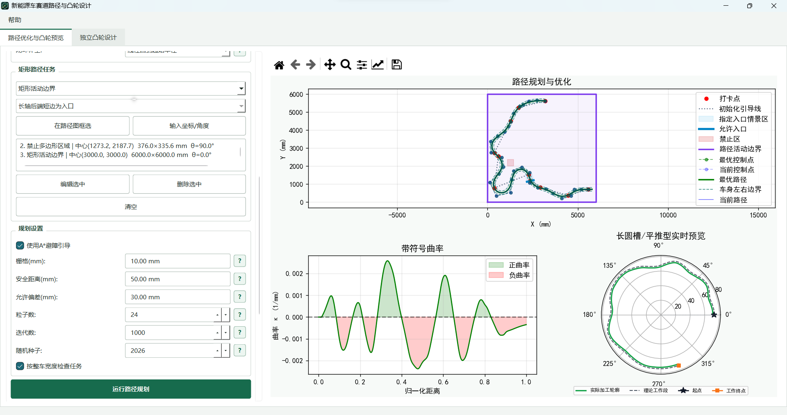
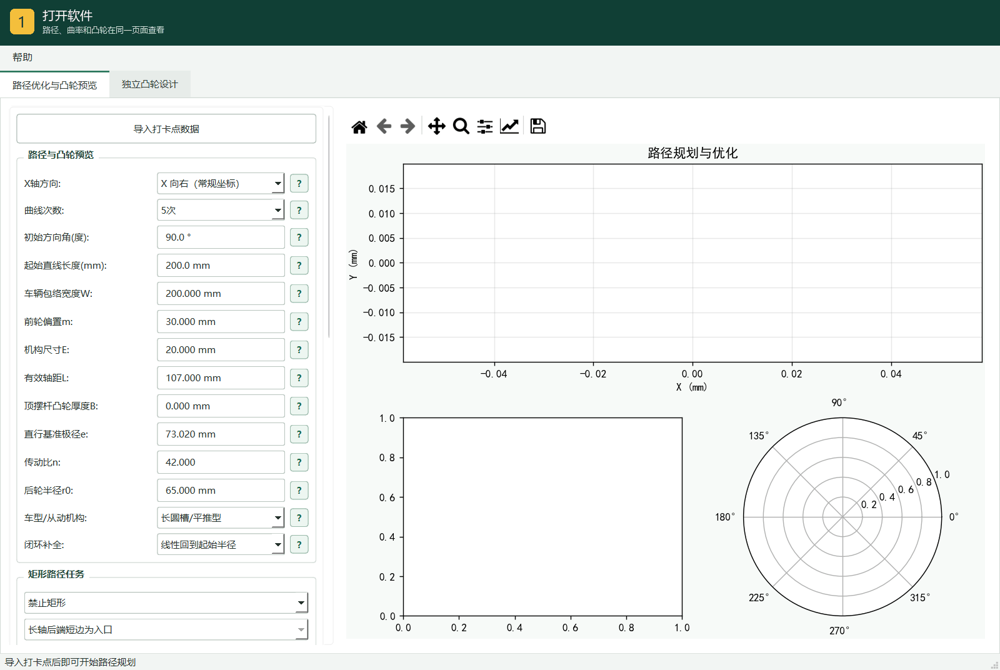
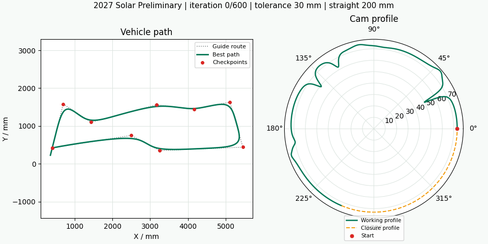
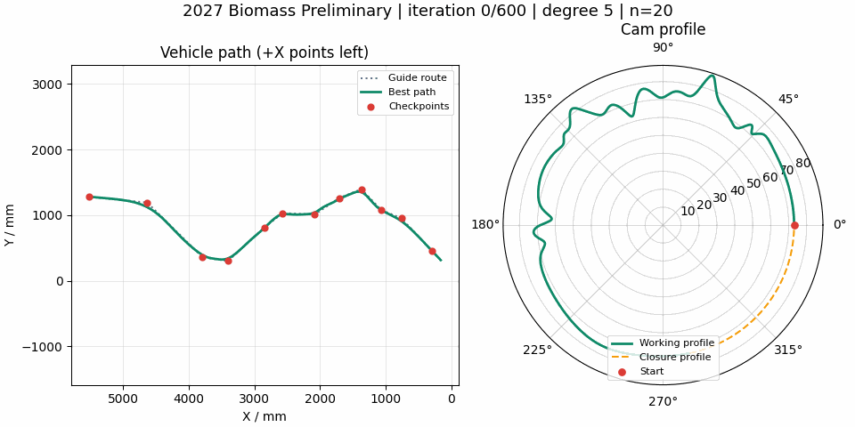
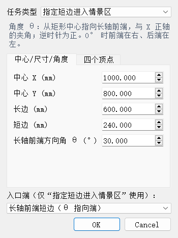
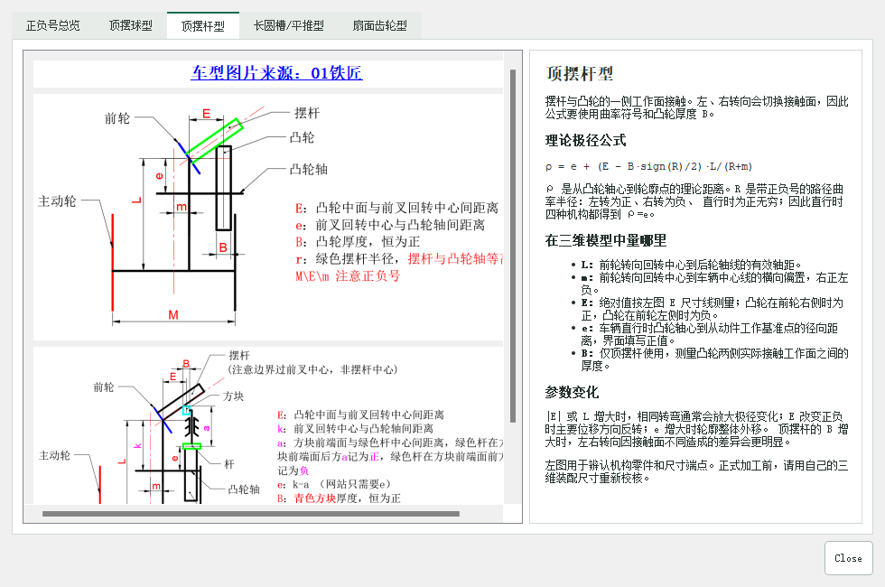

<div align="center">


# 新能源车赛道路径与凸轮设计

面向中国大学生工程实践与创新能力大赛新能源车赛道的路径规划、任务区校核与凸轮轮廓计算工具。

[](https://www.python.org/)
[](https://doc.qt.io/qtforpython-6/)
[](../../releases)
[](LICENSE)

[下载运行包](../../releases) · [快速开始](#快速开始) · [路线演示](#2027-初赛路线演示) · [使用说明](#使用流程)

</div>



路径、带符号曲率和凸轮轮廓在同一个界面中联动。导入打卡点后，可以添加禁止区、短边通道和指定入口情景区，运行路径优化，并同步观察凸轮工作段与闭环补全段。

> [!IMPORTANT]
> 软件会同时输出从动件中心的理论轮廓和考虑从动件半径的实际二维包络。更多细节请看[详细讲解视频以及下面介绍](assets/screenshots/app-overview.png)   待上传......

## 核心能力

| | 功能 | 说明 |
|---|---|---|
| 路径规划 | 固定起终点与起始方向 | 支持平滑曲线、直线-圆弧和自动分组圆链三种模式 |
| 场景任务 | 禁止区、短边通道、指定入口情景区 | 矩形可旋转，可在图中框选，也可输入中心、尺寸和角度 |
| 整车校核 | 车辆宽度与附加安全距离 | 约束检查考虑车辆包络，不只检查路径中心线 |
| 凸轮预览 | 路径优化时同步计算 | 支持顶摆球、顶摆杆、长圆槽/平推和扇面齿轮模型 |
| 坐标适配 | X 向右或 X 向左 | 适配常规地图和右下角原点地图，并统一左右转曲率符号 |
| 结果导出 | 路径与凸轮离散点 | 可导出真实路径、补全虚拟路径，以及实际与理论凸轮 XYZ 坐标 |

## 快速开始

### Windows 免安装包

在 [Releases](../../releases) 下载 `CamDesigner-Windows-x64.zip`，完整解压后运行 `CamDesigner.exe`。运行库和图片资源位于同一文件夹中，不要只复制 EXE。

### 从源码运行
提醒：建议直接使用安装包运行，源码目前未更新到最新版本，源码中场景任务设置、凸轮包络等暂未更新
！！！后续会视情况更新稳定版本！！！

推荐 64 位 Python 3.11：

```powershell
python -m venv .venv
.\.venv\Scripts\Activate.ps1
python -m pip install -r requirements.txt
python cam_gui.py
```

## 使用流程



演示采用 **5 次曲线、30 个粒子和 1000 次迭代**，最后一帧同时展示路径、曲率、凸轮轮廓与结果导出入口。

1. 导入 `examples/waypoints.txt` 或自己的打卡点文件。（examples中还有今年的两个赛题打卡点）
2. 选择 X 轴方向和路径模型，设置曲线次数或轮迹平滑级数、初始方向角和起始直线长度。
3. 根据赛题添加禁止区、短边通道或指定入口情景区。
4. 选择车型，填写机构尺寸和从动件半径；参数旁的 `?` 可以查看测量位置和正负号。
5. 设置允许偏差、粒子数和迭代数，开始路径规划。
6. 检查路径、任务区、曲率和凸轮工作角，再保存结果。

规划过程中可以暂停，使用路径图工具栏缩放和平移；继续规划时会恢复完整视野。相同数据、参数和随机种子可以复现同一次优化结果。

## 2027 初赛路线演示

两组动画均由程序真实训练生成，统一采用 24 个粒子、600 次迭代、5 次平滑曲线、30 mm 允许偏差、200 mm 起始直线和随机种子 2026。

### 太阳能电动车现场初赛

`examples/2027_solar_preliminary.txt` · X 向右 · 初始方向 `75.9638°` · 传动比 `42` · 最大偏差 `25.16 mm`



### 生物质能电动车现场初赛

`examples/2027_biomass_preliminary.txt` · X 向左 · 初始方向 `46.8087°` · 传动比 `20` · 最大偏差 `29.69 mm`



> [!NOTE]
> 初始方向按数据坐标计算：`0°` 沿 `+X`，`90°` 沿 `+Y`。生物质能地图的原点位于右下角，因此选择“X 向左（右下原点地图）”。

## 路径任务



| 任务 | 路径要求 |
|---|---|
| 禁止矩形 | 车辆包络不得进入矩形及其安全边界 |
| 短边通道 | 从一条短边进入、另一条短边离开，不得穿过长边 |
| 指定入口情景区 | 必须从指定短边首次进入，离开方向不限，但不得从其他边再次进入 |
| 活动边界 | 确保小车不出设定的场地边界 |
方向角 `θ` 是矩形中心指向长轴前端与 `+X` 的夹角。单击任务列表可以选中任务，双击或点击“编辑选中”可以修改尺寸、角度、类型和入口方向。

<details>
<summary><strong>打卡点格式与权重</strong></summary>

每行填写 `X Y`，单位为 mm；可选第三列为权重 `w`：

```text
5588 713
4463 375 2
2925 825 0.5
```

没有第三列时权重默认为 `1`。该点实际允许偏差为“界面允许偏差 ÷ 权重”：权重越大，路径越不能偏离该点。首点和末点固定，权重主要影响中间打卡点。

</details>

<details>
<summary><strong>车型、曲率与参数正负号</strong></summary>

路径左转时曲率和曲率半径为正，右转为负；直线曲率为 `0`，曲率半径为 `+inf`。俯视车辆并让车头朝前时，凸轮位于前轮右侧则机构尺寸 `E` 为正，位于左侧则为负。

程序内的“车型、公式与正负号”窗口包含四种机构的公式、尺寸测量位置和示意图。正式加工前，请用自己的三维装配尺寸重新校核。



**车型图片来源：[01铁匠](http://43.143.111.245:3030/)**。

</details>

<details>
<summary><strong>导出文件</strong></summary>

路径页生成：

```text
result.txt             # 真实工作路径
result_full_path.txt   # 真实路径 + 凸轮补全对应的虚拟路径
cam_xyz.txt                # 实际加工凸轮 X、Y、Z 坐标
cam_xyz_theoretical.txt    # 从动件中心的理论凸轮 X、Y、Z 坐标
```

路径文件固定为“序号、X、Y、曲率、曲率半径、归一化距离”六列。保存凸轮时，所选文件保存考虑从动件半径的实际包络，同目录自动生成带 `_theoretical` 后缀的理论轮廓；两者均为纯数值 `X Y Z`。选择“不补全”时没有完整一圈数据，路径页不会启用凸轮导出按钮。

</details>

## 版本与发布

当前仓库公开源码采用 [GPL-3.0-only](LICENSE)，界面使用 PySide6。PySide6 本身不要求业务代码采用 GPL，但 Qt、PySide6 和其他依赖的许可证及第三方声明仍应随运行包保留。

## 贡献者

<div align="center">

<a href="https://github.com/wangxt888/cam-designer/graphs/contributors">
  
</a>

感谢每一位参与代码、测试、文档和实车验证的贡献者。

</div>

---

<div align="center">

由 [wangxt888](https://github.com/wangxt888) 与？？？？（想要参与的你们）维护。

如果项目对你的备赛有帮助，欢迎点一个 **Star**。达到 **200 Star** 后，将在权利清晰、赛事规则允许的范围内整理并发布目前最新exe对应的源码并更新更多扩展功能。

### 微信支持

如果软件节省了你的备赛时间，也欢迎自愿支持后续维护。


</div>
